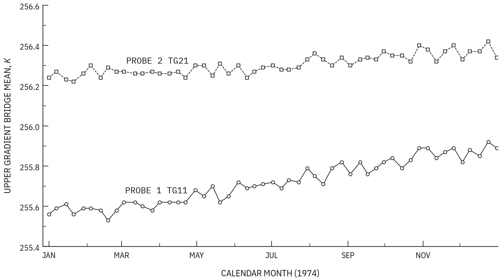
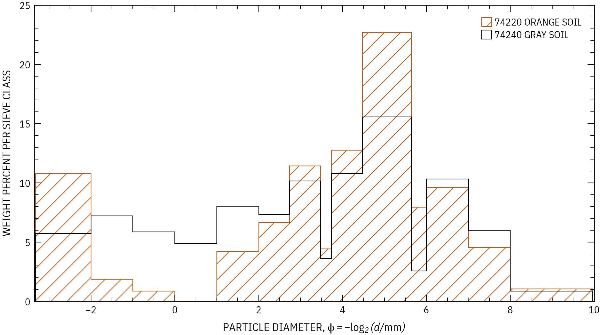
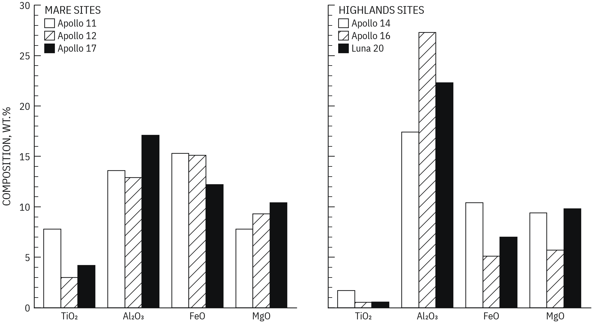

# lab74

[](examples/02_apollo17_hfe.ipynb)

`lab74` is a Matplotlib style layer for scientific and institutional 
figures in the technical print style of ca. 1965–1980.

The style uses fine rules, compact type, direct labels, monochrome textures, 
and one optional accent color. It does not add old-paper,
film-grain, or other retro effects.

## Installation

Install `lab74` from PyPI:

```console
pip install lab74
```

Requirements:
* `python>=3.12`
* `matplotlib>=3.8`
* `numpy>=1.26`

## Basic use

```python
import matplotlib.pyplot as plt
import lab74

lab74.use()

fig, ax = plt.subplots()
ax.plot(x, y)
ax.set(xlabel="Energy (GeV)", ylabel=r"$\sigma$ (nb)")
```

The `use()` function applies the style. The default style uses 
the `instrument` accent and proportional technical text.

Use these options to change the color or the typeface:

```python
lab74.use(accent="aerospace")  # Use a different accent.
lab74.use(accent=None)  # Use the monochrome line-series palette.
lab74.use(accent=None, face="mono")  # Use monospaced text.
```

You can also apply the packaged Matplotlib style sheet:

```python
plt.style.use(lab74.STYLE_PATH)
```

This method uses the default `instrument` accent.

## Plot tools

`lab74` includes small tools for annotations, error bars, grouped bars, hatched
regions, contours, maps, ticks, frames, and multipanel layouts. These tools
return normal Matplotlib artists. Thus, you can change the result with the
Matplotlib API.

`grouped_bar` applies the bar sequence across series, while `separated_bar`
applies it across individual bars. Both suppress tick marks, but not labels, on
the categorical axis.
The accented and monochrome sequences for each plot type are defined together
in [`src/lab74/sequences.py`](src/lab74/sequences.py).

Use ink and a maximum of one accent color in each figure. Set the final axis
limits before you add stipple. This makes the stipple density correct.

See [src/lab74/](src/lab74/) for all available tools and their
docstrings.

## Gallery

Executable notebooks are in the [examples/](examples/). 
They use scientific data from SILSO, the NASA archives, and the NOAA/NCEP–NCAR
Reanalysis 1 project. Rendered images are in [`examples/output/`](examples/output/).

[](examples/03_apollo17_soil_grain_size.ipynb)

[](examples/05_lunar_soil_composition.ipynb)
